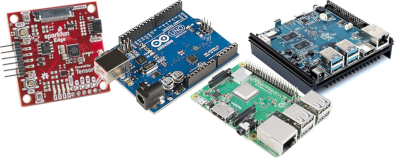

# deepC


[](https://travis-ci.org/github/ai-techsystems/deepC)
[](https://badge.fury.io/py/deepC)
[](https://pepy.tech/project/deepc)
[](LICENSE)
[](https://opencollective.com/dnnc)
[](https://gitter.im/ai-techsystems/community)

The deepC is a **vendor independent deep learning library, compiler and inference framework** designed for small form-factor devices including **μControllers, IoT and Edge devices**

## 🏃‍♂️ Using deepC

Here are few of many ways.

1. Try deepC with [Colab Noteboook](https://colab.research.google.com/drive/1EKgQcMCHr-0OsG9qJ4wXv7J4JFlPY7CK)
1. Install it on Ubuntu, raspbian (or any other debian derivatives) using ```pip install deepC```
1. Compile onnx model- [read this article](test/compiler/mnist/README.md) or [watch this video](https://youtu.be/BpFs83MU3HM)
1. Use deepC with a [Docker File](Dockerfile)

See more examples in [tutorial](tutorials/README.md) dir.

## 📛 what is deepC?

deepC library, compiler and inference framework is designed to **enable and perform** deep learning neural networks by focussing on features of small form-factor devices like micro-controllers, eFPGAs, cpus and other embedded devices like [raspberry-pi](https://www.raspberrypi.org/), [odroid](https://www.hardkernel.com/), [arduino](https://www.arduino.cc/), [SparkFun Edge](https://www.sparkfun.com/products/15170), [risc-V](https://www.amazon.com/Seeed-Studio-Sipeed-Maixduino-RISC-V/dp/B07SW9ZWQQ), mobile phones, x86 and arm laptops among others.



deepC also offers ahead of time compiler producing optimized executable based on [LLVM compiler tool chain](https://llvm.org/) specialized for deep neural networks with [ONNX](https://onnx.ai/) as front end.

## 📝 Design

Main components of **deepC** have been designed to represent and optimize the common deep learning networks in high level graph IR and to transform the computation graph to minimize memory utilization, optimize data layout and fuse computation patterns for different hardware backends.


Read more at [high level design document](docs/highLevelDesign.md)

## 💧 PreRequisites

* [ONNX 1.5](https://github.com/onnx/onnx/tree/rel-1.5.0#installation)
* [LLVM 8.0](http://releases.llvm.org/8.0.0/docs/GettingStarted.html#getting-started-quickly-a-summary)
* [Python 3.6](https://www.python.org/downloads/release/python-360/)
* [SWIG 3.0](https://sourceforge.net/projects/swig/files/swig/swig-3.0.12/)

## 💻 Development

Build and start modifying deepC locally from source code with following steps

### ⭕ Ubuntu 18.04

Follow the steps to install pre-requisites
```bash
sudo apt-get update
sudo apt-get install build-essential python3.6-dev python3-pip swig doxygen clang-format clang clang-8 llvm-8 llvm-8-dev protobuf-compiler libprotoc-dev
sudo pip3 install numpy==1.15.0 onnx==1.5.0
```

Once you are done, build deepC
```bash
git clone https://github.com/ai-techsystems/deepC.git
cd deepC
make
```
### ⭕ Mac OS / Windows 10

Make sure you have the below pre-requisites
#### Mac OS:
- [Python for Mac](https://www.python.org/downloads/mac-osx/)
- [Docker for Mac](https://docs.docker.com/v17.09/docker-for-mac/install/#download-docker-for-mac)

#### Windows 10:
- [Python for Windows](https://www.python.org/downloads/windows/)
- [Docker for Windows](https://docs.docker.com/v17.09/docker-for-windows/install/#download-docker-for-windows)

Once you are done, build deepC inside docker container
```bash
git clone https://github.com/ai-techsystems/deepC.git
cd deepC
python buildDocker.py
```

#### 📜 Output
```bash
find include src swig -name \*.h -print0 -o -name \*.cpp -print0 | xargs -0 -P8 -n1 clang-format -i
make -C src
make[1]: Entering directory 'deepC/src'
make -C core
make[2]: Entering directory 'deepC/src/core'
compiling broadcast.cpp
/usr/bin/g++ -O3 -Wall -std=c++14 -fPIC -march=native -msse2 \
    -isystem ./packages/eigen-eigen-323c052e1731 -I./include \
    -c broadcast.cpp -o obj/broadcast.o
compiling tensor.cpp
...
...
/usr/bin/g++ -shared  ./obj/dnnc_swig.o ./obj/dnnc_pyutils.o ./obj/dnnc_api.o -o lib/libdnnc.so
ln -s -f lib/libdnnc.so _dnnc.so
/usr/bin/python3 ../test/swig/basic.py
```

##    Current Support

| Supported Architectures 	|  Status  |
|-------------------------	|----------|
| Arm                     	|    ✔️   |
| Armv7                   	|    ✔️   |
| Arm64                   	|    ✔️   |
| AMD64                   	|    ✔️   |
| ppc64le                 	|    ✔️   |

| Supported OS 	| Distributions  	|   Status  |
|--------------	|----------------	|-----------|
| Linux        	| Ubuntu 18.04   	|    ✔️    |
| Linux        	| CentOS 6   		|    ✔️    |
| Linux        	| Arch Linux     	|    ✔️    |
| Linux        	| Manjaro        	|    ✔️    |
| Windows      	| 1803 and above 	|    ✔️    |
| Mac OS       	| Sierra and above	|    ✔️    |

## ➕ Contribute

dnn Compiler adopts apache committer model, we aim to create an open source project that is maintained and owned by the community. Checkout the Contributor Guide.

## 🙏 Acknowledgement
We acknowledge the efforts predecessor projects like [LLVM](https://llvm.org/), [ONNX](https://onnx.ai/) etc. to make this project a reality.

---

## 🕵️‍♂️ Why compiler❔
deepC is targeted towards devices with small formfactor like microcontrollers, which are part of all sorts of household devices: think appliances, cars, and toys. In fact, there are around 30 billion microcontroller-powered devices produced each year. They're cheap, require very little energy, and are very reliable.

By bringing deep learning models to tiny microcontrollers, we can boost the intelligence of billions of devices that we use in our lives, without relying on expensive hardware or reliable internet connections. Imagine smart appliances that can adapt to your daily routine, intelligent industrial sensors that understand the difference between problems and normal operation, and magical toys that can help kids learn in fun and delightful ways.

<a href="https://opencollective.com/dnnc"></a>

#### Organizations

Support this project with your organization. Your logo will show up here with a link to your website. [[Contribute](https://opencollective.com/dnnc/contribute)]

---

## Built on/with deepC

### Products
1. **[No code TinyML platform](http://cainvas.ai-tech.systems/)**, built with deepC technology.
2. **[No code TinyML Book](http://thetinymlbook.com/)**, with a chapter on deepC.

### Papers
- Paper: [Deep Neural Network Operators](docs/pubs/DNNC-operators-paper.pdf), appeared in [Proceedings of AITS Summit, 2019](https://www.amazon.com/Proceedings-AITS-Summit-2019-www-ai-techsystems-com-ebook/dp/B083ZJWFGT)
- Letter: [Gesture Recognition with deepC](docs/pubs/IJCRT%20-%20Gesture%20Recognition%20with%20deepC.pdf), appeared in [INTERNATIONAL JOURNAL OF CREATIVE RESEARCH THOUGHTS](https://ijcrt.org/papers/IJCRT2111106.pdf)
- Poster: [Deep Neural Network Compiler and Inference Framework for microcontrollers and microcomputers](docs/pubs/AITS%20poster.pdf), appeared in [IRISS 2020
14th Inter-Research-Institute Student Seminar in Computer Science](https://events.iitgn.ac.in/2020/IRISS/)

### Paper Citations
- Title: [Artificial Intelligence in the IoT Era: A Review of Edge AI Hardware and Software](https://ieeexplore.ieee.org/abstract/document/9770931/) 
  - [Download pdf](https://fruct.org/publications/fruct31/files/Sip.pdf)
- Title: [Tiny transformers for environmental sound classification at the edge](https://arxiv.org/abs/2103.12157) 
  - [Download pdf](https://arxiv.org/pdf/2103.12157)
- Title: [Efficient Edge Analytics: Addressing Cyber-Physical MASINT with Machine Learning on Audio at the Edge](https://repository.lib.fit.edu/handle/11141/3223)
  - [Download pdf](https://repository.lib.fit.edu/bitstream/handle/11141/3223/ELLIOTT-DISSERTATION-2020.pdf?sequence=1&isAllowed=y)

### Book Chapter
1. deepC Chapter in book [Introduction to TinyML](http://thetinymlbook.com/), available on [Amazon](https://www.amazon.com/dp/B0B662D7ZW/) and other retailers
