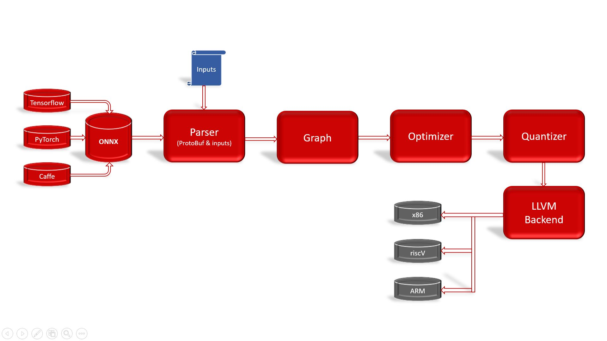

# dnn Compiler
---

## 📛 Introduction 

dnn Compiler is designed to **enable and perform** deep learning neural networks by focussing on features of custom ai-accelerators like FPGAs, eFPGAs and other embedded devices like risc-V, raspberry-pi and others.

dnn Compiler is ahead of time compiler producing optimized executable based on [LLVM compiler tool chain](https://llvm.org/) and [openAcc](https://www.openacc.org/) specialized for deep neural networks with [ONNX](https://onnx.ai/) as front end.

## 📝 Design

Main component of **dnn Compiler** has been designed to represent and optimize the common deep learning networks in high level graph IR and to transform the computation graph to minimize memory utilization, optimize data layout and fuse computation patterns for different hardware backends.



Read more at [high level design document](docs/highLevelDesign.md) 

## PreRequisites

* [ONNX](https://github.com/onnx/onnx#installation)
* [LLVM](https://apt.llvm.org)

## ⚙ Installation
build and install dnn Compiler locally from source code with following steps

```
git clone https://github.com/ai-techsystems/dnnCompiler.git 
cd dnnCompiler
mkdir build && cd build
cmake ..
make
```

#### 📜 Output
```
[ 50%] Building CXX object CMakeFiles/dnnc.dir/src/main.cc.o
[ 66%] Building CXX object CMakeFiles/dnnc.dir/onnx-operators.pb.cc.o
[ 83%] Building CXX object CMakeFiles/dnnc.dir/onnx.pb.cc.o
[100%] Linking CXX executable dnnc
[100%] Built target dnnc
```

## 🏃‍♂️ Usage
```
[build]$ wget https://onnxzoo.blob.core.windows.net/models/opset_8/mnist/mnist.tar.gz
[build]$ tar xvf mnist.tar.gx
[build]$ ./dnnc
```
*Usage:  ./dnnc onnx_model_file*
```
[build]$ ./dnnc mnist/model.onnx
reading CNTK graph from mnist/model.onnx 
populating graph ...
```

## ➕ Contribute

dnn Compiler adopts apache committer model, we aim to create an open source project that is maintained and owned by the community. Checkout the Contributor Guide.

## 🙏 Acknowledgement 
We acknowledge the efforts predecessor projects like [LLVM](https://llvm.org/), [ONNX](https://onnx.ai/) etc. to make this project a reality.


---

**🚧 Project Under Development.** *Stay tuned. We plan to release the first version in the third quarter of 2019.*
